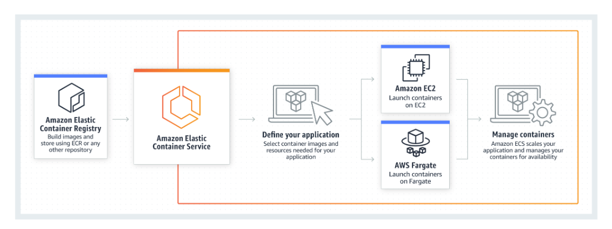
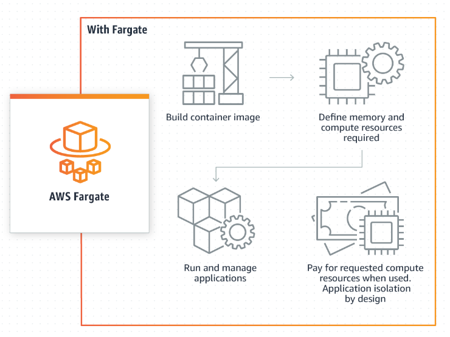

## Version 1
- Begin by having Dockerhub account. Which you will use to create a public repository to host your image. 
    > Refer to the Docker Documentation on how to create a public repo [Here](https://docker-docs.uclv.cu/docker-hub/repos/) 

- With your Dockerfile ready, follow with this command which uses the repo name from your public dockerhub repo: 
```
docker build -t nickgoko/webapp-v1 . 
```

- To check if your image has build perform the command below:
```
docker images
```

- In order to push the image to Dockerhub you need to login using the command below. You will then need to input your Dockerhub account username and password. 
```
docker login
```

- After successfully logging in. Push the image to docker hub
```
docker push nickgoko/webapp-v1
```
- Navigate to your Dockerhub repo to confirm that the push was successful. 

## Version 2

### Objective- A Working docker image deployed on AWS and running on Fargate.

### Requirements
- Fargate Launch Type
    
    
- AWS CLI installed
- Docker Image version 2

#### Step 1
Improve upon the functionality v1 of the web app to a version to. 
Create index.php
Then  build a docker image and run the container to test the application works locally
```
docker build -t docker-web-app . 
```


**Steps:**

**1. Create an Amazon ECS Cluster:**

1. Open the AWS Management Console and navigate to the Amazon ECS service.
2. Click on "Clusters" in the left navigation pane.
3. Click on "Create cluster".


**2. Create an ECR Public Repository:**

1. Navigate to the Amazon ECR service in the Management Console.
2. Click on "Repositories" in the left navigation pane.
3. Click on "Create repository".

**3. Upload/Push Docker Image to ECR Repository (Using AWS CLI):**

**Note:** This step requires the AWS CLI installed and configured with your IAM user credentials (access key and secret key).

- Follow the commands provided

![[Pasted image 20240308112814.png]]
- Once it works you should be able to view the image in your repository  

**4. Create an ECS Task Definition with Fargate Launch Type:**

1. In the ECS Management Console, navigate to "Task Definitions".
2. Click on "Create task definition".
3. Choose a compatibility option (Fargate)

 
**5. Launch a New Fargate Task:**

1. In the ECS Management Console, navigate to "Tasks".  
2. Click on "Run new task".  
3. Choose your cluster and task definition.  
4. Under "Launch type", select "Fargate".  
5. Configure the number of tasks to launch (usually 1).  
6. (Optional) Configure advanced launch settings like resource allocation for Fargate tasks.  
7. Click on "Run" to launch the task using your created task definition.


Tested it locally  
`docker run -p 9000:80 public.ecr.aws/j0n8e2w8/my-php-app-repo:latest`


- Login page successful with task run on ECS on port 9000  


- Login page successful with correct username & password.  


Configure the following settings.
- **Container name**: `my-php-app`
- **Image**: Paste the **Image URI** of the application container image, which you copied to a text editor in a previous step.
- **Memory Limits**: Select _Hard limit_ and enter `256`. (This setting defines the maximum amount of memory that the container is allowed to use.)
- **Port mappings > Container port**: `3000` (This setting specifies the port where the container receives requests. You do not need to enter a value in **Host port**.)  
### Terms
- **Task definition**- specify the parameters for the application and launch type to use.
- **Cluster** - logical grouping of container instances that you can place tasks on. Clusters can contain tasks using the Fargate and EC2 launch type.
- **Service** - Enables you to specify how many copies of the task definition to run and maintain in a cluster. 
- **Task** - an instantiation of a task definition with a cluster. When we create tasks using Amazon ECS we place them in a cluster.
- **Amazon ECR** - makes it easy for developers to store, manage, and deploy Docker container images. In addition, **Amazon ECR** is integrated with **Amazon ECS**, which enables **Amazon ECS** to pull container images directly for production deployments.
- 